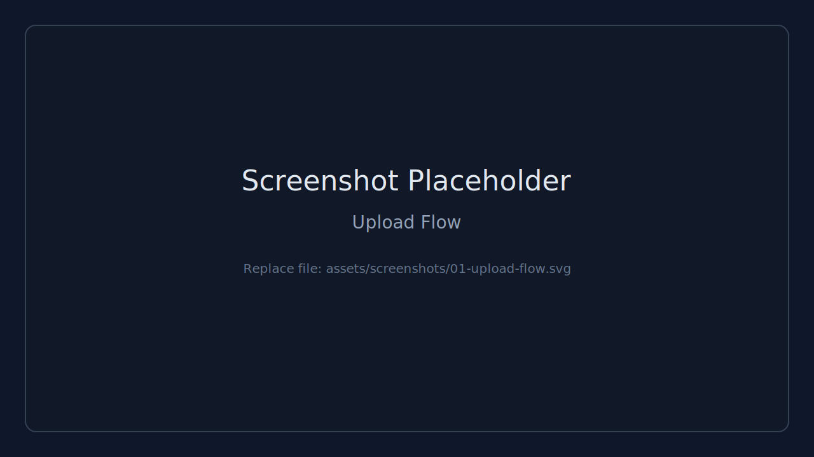
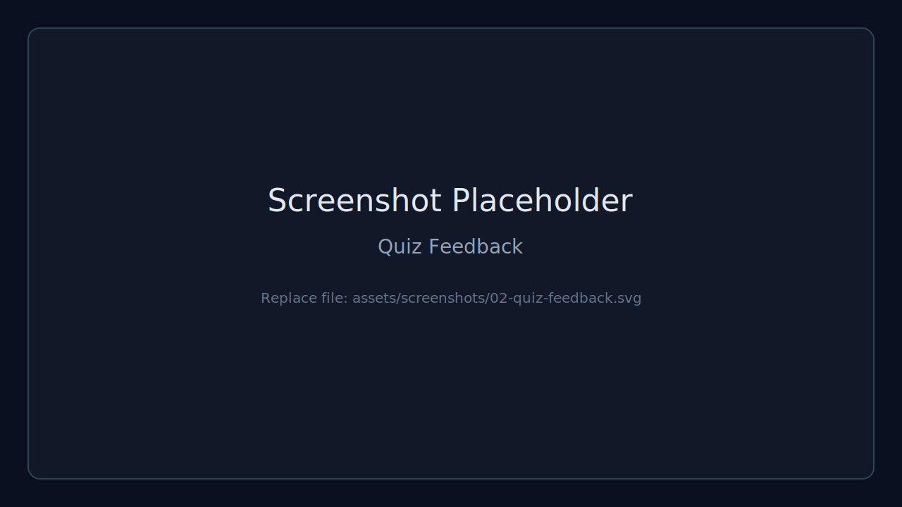
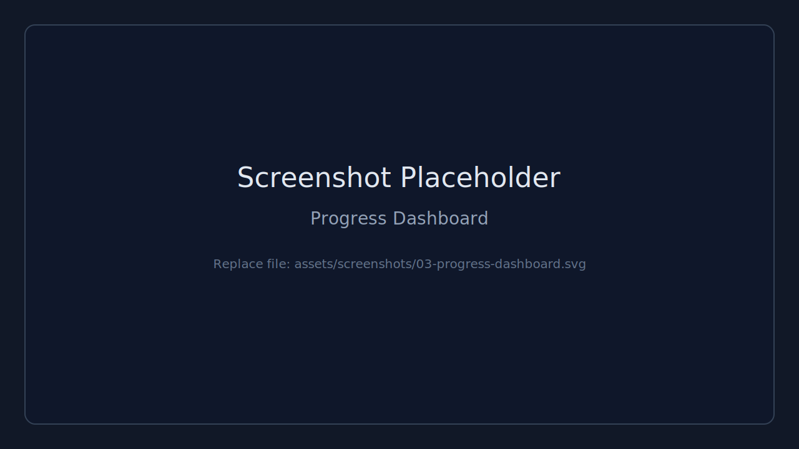
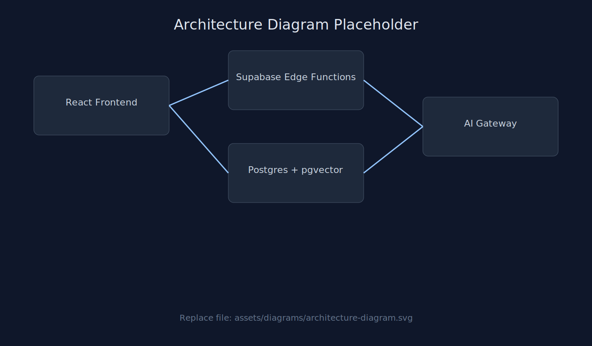

# SyllabusSync AI

AI-powered adaptive math tutor for class 9-12 students.


SyllabusSync AI personalizes learning by grounding quizzes and explanations in the student's uploaded syllabus. It combines syllabus ingestion, semantic retrieval, adaptive quiz feedback, and a doubt-clearing assistant in one fast web app.

## Live Demo

- Live URL: Coming soon
- Video Walkthrough: Coming soon
- Local Demo: Run npm run dev and open the local Vite URL

### Product Identity


### Screenshot Gallery





All visual placeholders are organized in [assets/README.md](assets/README.md).

## Architecture Diagram



High-level data flow:

1. Frontend uploads syllabus content.
2. Edge functions ingest and embed content.
3. Postgres + pgvector supports retrieval.
4. AI gateway powers quiz, teach, evaluate, and doubt features.

Replace the diagram file with your final architecture export when ready while keeping the same filename for stable README rendering.

## Why This Project

Students often practice generic questions that do not match their school syllabus. This project solves that by:

- extracting topics directly from uploaded syllabus content,
- generating topic-specific grounded quizzes,
- explaining mistakes step-by-step in simple language,
- and tracking learning progress over time.

## Resume-Ready Impact

Use this section as a template when presenting in resumes or interviews.

- Built an AI-driven syllabus-grounded tutoring platform that adapts quiz generation and feedback to student-uploaded curriculum content.
- Implemented vector retrieval with pgvector to improve relevance of generated questions and explanations against source syllabus chunks.
- Designed a full-stack learning loop (ingest -> teach/quiz -> evaluate -> analytics) using React, Supabase Edge Functions, and Postgres.
- Developed streaming doubt-resolution UX and topic-wise progress analytics to improve feedback speed and learner visibility.

## Core Features

- Syllabus Upload: PDF/text ingestion with automatic topic extraction
- Grounded Quiz Generation: Questions tied to retrieved syllabus chunks
- Answer Evaluation: Correctness check + concept-level feedback
- Teach Mode: Concept explanation, analogy, and worked example
- Doubt Mode: Streaming AI chat for follow-up clarifications
- Progress Analytics: Topic-wise accuracy and mastery dashboard
- Anonymous Device Identity: No login required for local progress

## Tech Stack

- Frontend: React 18, TypeScript, Vite, Tailwind CSS, shadcn/ui
- Data Layer: Supabase JS, TanStack Query
- Backend: Supabase Edge Functions (Deno)
- Database: Postgres + pgvector
- Visualization: Recharts
- PDF Parsing: pdfjs-dist

## Architecture

1. User uploads syllabus PDF/text.
2. Frontend sends content to ingest-syllabus.
3. Backend chunks content, extracts topics, and stores vector embeddings.
4. User selects a topic and starts Quiz or Teach mode.
5. Retrieval uses cosine similarity against syllabus_chunks.
6. AI gateway returns grounded output (quiz/lesson/evaluation/chat).
7. Attempts are saved to quiz_attempts for analytics.

## Repository Layout

```text
src/
  components/              Feature UI (upload, quiz, teach, doubt, dashboard)
  integrations/supabase/   Typed Supabase client
  lib/                     Helpers (PDF extraction, device id)
  pages/                   Route pages

supabase/
  functions/               Edge functions
  migrations/              SQL schema and vector search function
```

## Edge Functions

- ingest-syllabus: parse + topic extraction + chunk embedding storage
- generate-quiz: retrieval + grounded quiz generation
- evaluate-answer: answer evaluation and learning feedback
- teach-topic: friendly lesson generation
- doubt-chat: streaming tutor chat

Function config lives in [supabase/config.toml](supabase/config.toml).

## Data Model

Defined in [supabase/migrations/20260419133926_639a8a17-f84a-4b54-9072-c14e713b8cb6.sql](supabase/migrations/20260419133926_639a8a17-f84a-4b54-9072-c14e713b8cb6.sql):

- syllabi
- syllabus_chunks (vector(768) embedding)
- quiz_attempts
- match_syllabus_chunks(query_embedding, match_syllabus_id, match_count)

## Quick Start

### 1) Install

```bash
npm install
```

### 2) Configure frontend env

Create .env from .env.example and set values:

```bash
VITE_SUPABASE_URL=https://YOUR_PROJECT_REF.supabase.co
VITE_SUPABASE_PUBLISHABLE_KEY=YOUR_SUPABASE_ANON_KEY
```

### 3) Run app

```bash
npm run dev
```

### 4) Quality checks

```bash
npm run lint
npm run test
```

## Supabase Setup

### Use an existing Supabase project

```bash
supabase link --project-ref YOUR_PROJECT_REF
supabase db push
supabase secrets set AI_GATEWAY_API_KEY=... AI_GATEWAY_URL=... SUPABASE_URL=... SUPABASE_SERVICE_ROLE_KEY=...
supabase functions deploy ingest-syllabus
supabase functions deploy generate-quiz
supabase functions deploy evaluate-answer
supabase functions deploy teach-topic
supabase functions deploy doubt-chat
```

### Local Supabase (optional)

```bash
supabase start
supabase db push
supabase functions serve --env-file .env
```

## Environment Variables

Frontend vars:

- VITE_SUPABASE_URL
- VITE_SUPABASE_PUBLISHABLE_KEY

Edge function secrets:

- AI_GATEWAY_API_KEY
- AI_GATEWAY_URL
- SUPABASE_URL
- SUPABASE_SERVICE_ROLE_KEY

## Production Readiness Notes

- verify_jwt is currently false in function config for anonymous usage.
- RLS policies are permissive for rapid development.
- For production: enable JWT verification, tighten RLS, and add abuse controls.

## Documentation

- Contributing guide: [CONTRIBUTING.md](CONTRIBUTING.md)
- Security policy: [SECURITY.md](SECURITY.md)
- License: [LICENSE](LICENSE)

## License

MIT License. See [LICENSE](LICENSE).
